# DeepLog: 基于深度学习对系统日志进行异常检测和诊断

**摘要**

异常检测是构建安全可靠系统的关键步骤。系统日志的主要目的是记录系统状态和重大事件在不同的临界点来帮助调试系统故障和执行根源分析。这样的日志数据在几乎所有的计算机系统中都是通用的。日志数据是了解系统状态和性能问题的重要和有价值的资源;因此，各种系统日志自然是在线监视和异常检测的良好信息来源。我们提出了一种利用长短时记忆(LSTM)的深度神经网络模型DeepLog，将系统日志建模为自然语言序列。这使DeepLog可以自动地从正常执行中学习日志模式并在正常执行情况下日志模式偏离日志数据训练的模型时检测异常。此外,我们演示了如何以在线方式增量更新DeepLog模型，以便其可以随着时间的推移适应新的日志模式。此外，Deeplog从底层系统构建工作流，以便一旦检测到异常，用户就可以诊断出检测到的异常并有效地进行根本原因分析。对于大型日志数据进行的广泛实验评估表明，Deeplog的性能优于基于传统数据挖掘方法的其他现有的日志异常检测方法。

**关键词**

异常检测；深度学习；日志数据分析

## 1. 引言

异常检测是构建安全可靠的计算系统的一个重要任务。随着系统和应用程序比以往任何时候都变得越来越复杂，它们会遇到更多的错误和漏洞，攻击者可能利用这些错误和漏洞来发起攻击。这些攻击也越来越复杂。因此，异常检测变得更具挑战性，并且许多基于标准数据挖掘的传统方法不再有效。

系统日志在各个关键点记录系统状态和重大事件，以帮助调试性能问题和故障，并进行根本原因分析。这样的日志数据几乎在所有计算机系统中普遍存在，并且是了解系统状态的宝贵资源。此外，由于系统日志记录了活跃运行过程中发生的重要事件，因此它们是用于在线监视和异常检测的极佳信息源。

利用系统日志数据进行异常检测的现有方法可以大致分为三类：基于PCA的日志消息计数器方法，基于不变量挖掘的方法来捕获不同日志键之间的共现模式和基于工作流的方法以识别程序逻辑流程中的异常执行。尽管它们在某些情况下是成功的，但它们都不能作为一种有效的通用异常检测方法，即能够以在线的方式防御各种攻击。

这项工作提出了DeepLog，这是一种数据驱动的异常检测方法，可以利用大量系统日志。DeepLog设计背后的主要灵感来自自然语言处理：我们将日志条目视为遵循某些模式和语法规则的序列元素。确实，系统日志是由遵循严格的逻辑和控制流程集的程序生成的，并且非常类似于自然语言（尽管在词汇方面结构更严格，受约束）。为此，DeepLog是一个深层神经网络，它使用长短期记忆（LSTM）对日志条码的序列进行建模。这使DeepLog可以从正常执行中自动学习日志模式的模型，并将与正常系统执行的偏差标记为异常。此外，由于它是一种学习驱动的方法，因此，可以增量地更新DeepLog模型，以便它可以适应随着时间而出现的新日志模式。

**挑战**：日志数据是非结构化的，并且它们的格式和语言在系统之间可能会显著不同。即使知道发生了错误，使用非结构化日志来诊断问题也已经很困难。从大量日志数据中进行在线异常检测更具挑战性。一些现有的方法使用基于规则的方法来解决此问题，这需要特定的领域知识。例如，使用“IP地址”之类的功能来解析日志。但是，这对于一般用途的异常检测不起作用，在这种情况下，几乎不可能先验地了解不同类型的日志中有哪些有趣的功能（并防范不同类型的攻击）。

为了及时发现异常，必须及时进行检测，以便用户可以干预正在进行的攻击或系统性能问题[10]。 决策将以流方式进行。其结果是需要对整个日志数据进行多次传递的offine方法不适用于我们的设定[22，39]。我们还希望能够检测未知类型的异常，而不是针对特定类型的异常。 因此，以前的工作[44]使用正常和异常（对于特定类型的异常）日志数据条目来训练二分类器以进行异常检测在这种情况下是没有用的。

并发是另一个挑战。 显然，日志中日志消息的顺序为诊断和分析提供了重要信息（例如，确定程序的执行路径）。但是，在许多系统日志中，日志消息是由几个不同的线程或同时运行的任务产生的。 这种并发性使得难以应用基于工作流的异常检测方法[42]，该方法将针对单个任务的工作流模型用作生成模型来与一系列日志消息进行匹配。

最后，每个日志消息都包含丰富的信息，例如日志键和一个或多个度量值，以及其时间戳。整合和利用这些不同信息的整体方法将更加有效。大多数现有方法[22、32、39、41、42、44]仅分析日志消息的一个特定部分（例如，日志key），这限制了它们可以检测到的异常的类型。

**我们的贡献**：循环神经网络（RNN）是一个人工神经网络，它使用循环将最后一个状态的输出转发到当前输入，从而跟踪历史以进行预测。长短期记忆（LSTM）网络[13、18、27]是RNN的一个实例，能够记住序列的长期依赖性。LSTM已证明在各种任务中都取得了成功，例如机器翻译[35]，情感分析[8]和医学自我诊断[20]。

受到观察的启发，系统日志中的条目是由执行结构化源代码（因此可以视为结构化语言）产生的一系列事件，因此，我们使用LSTM神经网络设计DeepLog框架，以通过系统日志在线检测异常。 DeepLog不仅在日志条目中使用日志键，还使用度量值进行异常检测，因此，它能够捕获不同类型的异常。 DeepLog仅取决于小的训练数据集，该数据集由一系列“正常日志条目”组成。 在训练阶段之后，DeepLog可以识别正常的日志序列，并可以以流方式用于对传入日志条目进行在线异常检测。

直观上，DeepLog隐式地从与常规系统执行路径相对应的训练数据中捕获日志条目之间潜在的非线性和高维依赖性。为帮助用户在发现异常后诊断问题，DeepLog还在训练阶段从日志条目构建工作流模型。DeepLog将并发任务或线程产生的日志条目分为不同的顺序，以便可以为每个单独的任务构建工作流模型。

我们的评估表明，在以前的工作中探索的大型HDFS日志数据集[22，39]上，仅对很小一部分（少于1％）的日志条目进行了训练，这些日志条目对应于正常的系统执行，DeepLog在其余99％的日志条目上可以达到几乎100％的检测精度。来自大型OpenStack日志的结果有类似的趋势。此外，DeepLog还提供了通过合并实时用户反馈来在检测阶段逐步更新其权重的功能。更具体地说，如果正常日志条目被错误地分类为异常，DeepLog提供了一种用于用户反馈的机制。 然后，DeepLog可以使用此类反馈随着时间的推移在线动态调整其权重，以使其适应新的系统执行（因此为新的日志）模式。

## 2. 预备知识

### 2.1 日志解析

首先，我们将非结构化的无格式文本日志条目解析为结构化表示形式，以便我们可以学习此结构化数据的序列模型。例如先前的几个工作[9, 22, 39, 42, 45]所示，一种有效的方法是从每个日志条目中提取一个“日志键”（也被称为消息类型）。日志体的日志键是指源代码中print语句中的字符串常量k，该代码在执行期间打印出e。例如，对于日志体``e="Took 10 seconds to build instance"``的日志键是``k=Took * seconds to build instance``，即打印语句``printf("Took %f seconds to build instance.")``中的字符串常量。注意在日志键中将参数抽象为星号。这些指标值反映了基础系统状态和性能状态。某些参数的值可以用作特定执行序列的标识符，例如HDFS日志中的block_id和OpenStack日志中的instance_id。这些标识符可以将日志条目组合在一起，也可以将并发进程生成的日志条目分开，以分离处单线程顺序序列[22, 39, 42, 45]。最新的日志解析方法的代表是Spell[9]。Spell是一种无监督的流式解析器，它基于LCS（最长公共子序列）的思想以在线方式解析传入的日志条目。

过去的日志解析工作[22, 39, 42, 44]丢弃了日志条目中的时间戳和/或参数值，仅使用日志key来检测异常。DeepLog存储每个日志体e的参数值，以及e和它之前日志的时间差，作为一个向量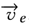，除了日志key，DeepLog也使用了该向量，正如表1中的示例，该示例显示了OpenStack中多次执行虚拟机VM删除任务的一系列日志条目的解析结果。

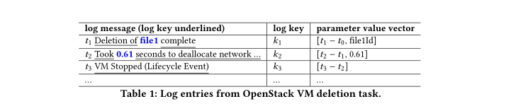

### 2.2 DeepLog结构和概述

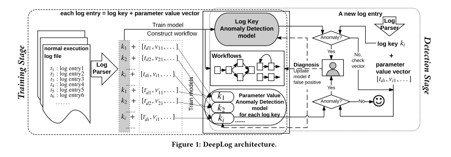

如图一所示，DeepLog的体系结构中包含3个组件：日志键异常检测模型、参数值异常检测模型、用于诊断已检测到的异常工作流模型。

**训练阶段**：DeepLog的训练数据是来自正常系统执行路径的日志条目。每个日志条目都解析成一个日志key和一个参数值value向量。DeepLog使用训练日志文件中解析的日志key序列来训练一个日志key异常检测模型。并构建用于诊断目标的系统执行工作流模型。对于每个不同的键key，DeepLog还会训练并维护一个模型，用于检测由这些度量值反映的系统性能异常，这些度量值由参数k向量系列训练得到。

**检测阶段**：一个新到达的日志条目被解析为日志键key和一个参数值向量。DeepLog首先使用日志键异常检测模型检查传入的日志键key是否正常，如果是，则DeepLog会进一步对于该日志key使用参数值异常检测模型检测参数值向量。如果新日志条目的日志键或它的参数值向量被预测为异常，则将其标记为异常。最后，如果被标记为正常，则DeepLog的工作流程将为用户提供语义信息，以诊断异常。执行模式可能会随时间变化或不包含在原始训练数据中。DeepLog还提供了收集用户反馈的选项，如果用户将检测到的异常标记为误报，则DeepLog可以将其用作一个已标记的记录，以逐步更新该模型，并进一步整合和适应新模式。

### 2.3 攻击模型

DeepLog可学习由正常系统执行路径产生的一系列日志条目中嵌入的全面而复杂的关联和模式。之后我们假设系统日志本身是安全且受保护的，并且攻击者无法攻击日志本身的完整性。我们还假设攻击者无法修改系统源代码以更改它的日志记录行为和模式。也就是说，从广义上讲，我们考虑两种类型的攻击：

1. 导致系统执行异堂的攻击，从而寻致系统日志中出现异常模式。例如，拒绝服务(DoS)攻击可能导致执行缓慢从而导致性能异常，这反映在与参数值向量序列的日志时间戳差异中；导致服务器反复重启的攻击，例如Blind Return Oriented Programming (BROP)
   atack [5] ，显示为服务器重启日志键key过多；以及可能导致任务中止的任何攻击，以至于相应的日志序列提前结束和/或出现异堂日志条目。
2. 由于系统监测服务的日志记录活动，攻击可能会在系统日志中留下痕迹。一个示例就是入侵检测系统(IDS)记录的可疑活动。

## 3. 异常检测

### 3.1 执行路径异常

我们首先描述使用日志key序列如何检测执行路径异常。因为源代码中（打印日志条目的）不同打印语句的总数是恒定的，因此不同日志键的总数也是恒定的。令K = ( k1, k2,.......kn )表示来自日志生成系统源代码的一组独特的日志键。一旦日志条目被解析为日志键，日志键序列就会反映出一条执行路径，该路径表明了日志打印语句的特定执行顺序。令mi 表示一个日志键序列中位置i的键值，显然，mi 可能会选择K中的n个可能键之一，并且很大程度上取决于mi 之前出现的最近的键。

我们可以将日志键序列中的异常检测建模为一个多分类问题，其中每个不同的日志键都定义一个类。我们将DeepLog作为最近上下文的多分类器进行训练。输入是最近日志键的历史记录，输出是一个来自K的n个日志键的概率分布，表示序列中下一个日志键ki∈ K的概率。

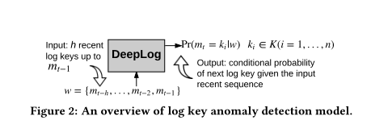

图2总结了分类设置。假设t是要显示的下一个日志键的序列id。用于分类的输入是h个最近的日志键的窗口w。也就是说，w={mt-h,..., mt-2,.mt-1}，其中每个mi 在K中，并且是来自日志条目ei 的日志键。注意，在w中同样的日志键值可能出现多次。训练阶段的输出是一个条件概率分布模型Pr[mt = Ki|w]，对于每个 ki∈ K(i=1,.....,n)。检测阶段使用此模型进行预测，并将预测的输出与实际的观察到的日志键值进行比较。

**训练阶段**：训练阶段依赖于底层系统的正常执行所产生的一小部分日志条目。对于训练数据中每个长度为h的日志序列，DeepLog通过将 ki∈ K作为下一个日志键值的概率分布的方式更新模型本身。例如，假设一个来自正在执行过程的小日志文件被解析为一个日志键序列：{k22, k5, k11, k9, k11, k26}。给定一个窗口大小h=3，则训练DeepLog的输入序列和输出序列是：{k22, k5, k11  --> k9 }, {k5, k11, k9 --> k11 }, { k11, k9, k11 --> k26  }。

**检测阶段**：Deeplog执行异常检测是以一种在线的，流式的方式。为了检测一个目标日志键mt（从一个目标日志条目et解析出）是否能被视为正常或异常，我们发送w={mt-h,..., mt-2,.mt-1}到DeepLog，作为它的输入。输出是一个概率分布Pr[mt = Ki|w] = {k1:p1, k2:p2,....., kn:pn}，描述了在给定历史上下文情况下每个日志键从K中选择作为下一个日志键值的概率。

实际上，多个日志键值可能出现为mt。例如，如果系统正在尝试连接一个主机，然后mt可能是``Waiting for * to respond``，或者是``Connected to *``；这两个都是正常的系统行为，DeepLog必须能够在训练过程中学习这种模式。我们的策略是排序所有可能的日志键K，基于它们的概率Pr[mt = Ki|w]，并且如果它在前g个候选值之内，则将该键值视为正常，否则，日志键会被标记为来自异常执行。

#### 3.1.1 传统的N-gram模型

将从一个固定词汇表中提取的单词序列的概率问题归于浯言建模的经典问题。在自然语言处理(NLP)社区中进行了广泛的研究[24]。在我们的案例中，每个日志键都可以看作是来自词汇表K的一
个单词。将概率分配给任意长序列的经典语言建模方法是N-gram模型。即序列中的特定单词仅受其最近的上文影响，而不是整个历史内容。在我们的设定中，这近似等于设定Pr(mt = Ki|m1, ... , mt-1) = Pr(mt = Ki|mt-N, ... , mt-1)，具中N表示被考虑的最近历史上文的长度。

对于训练，我们可以使来自大型语料库的相对频数计数来计篡此概率，得到最大似然估计。给定一个的长序列{m1, ... , mt},我们可以使用与序列{mt-N, ... , mt-1}相应的相对频数计数，{mt-N, ... , mt-1, mt = Ki}估计观察到的第i个键ki的概率。换句话说，Pr(mt = Ki|m1, ... , mt-1)
= count(mt-N, ... , mt-1,mt=ki) / count(mt-N, ... , mt-1)。注意我们将在整个键序列上使用大小为N的滑动窗囗对这些次数进行计数。为了将N-gram模型应用在我们的设定中。我们简单地使用N作为历史窗囗大小，即在我们的实验中，当N-gram模型被应用时，设置h=N，其中h是历史滑窗囗大小，正如图2所示。我们将此作为一个基线方法。

#### 3.1.2 LSTM方法

近年来，使用循环神经网络的神经语言模型在各种NLP任务[3, 25]中被证明非常高效。与N-gram语言模型相比，基于LSTM的模型在一个序列上可以编码更复杂的模式和维持长范围状态[34]。系统日志中并发任务的复杂模式和相互交织的日志条目会使得传统浯言模型变得低效。因此，DeepLog使用LSTM神经网络[18]从日志序列中进行异常检测。

给定一个日志键序列，一个LSTM网络模型被训练，用以使ki∈ K作为训练数据序列所反映的下一个日志值的可能性最大化。换句话说，它学习一个能够最大化训练日志键序列的概率的概率分布 Pr(mt = Ki|mt-h, ... , mt-2,mt-1)。

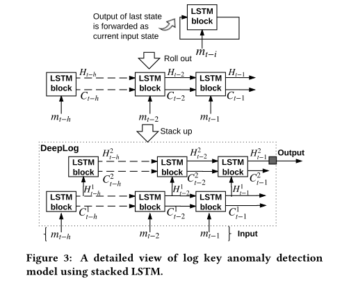

图3是我们的设计。图的顶部显示了一个LSTM模块，它反映了LSTM的重复性。每个LSTM块都会为其输入记录一个状态，作为一个固定维度的向量。来自上一个时间步的LSTM块的状态连同其（外部）数据输入（该特定示例中是mt-i)一起传入到下一个输入，来计算新的状态和输出。这就是将历史信息传递到单个LSTM块中并在其中进行维护的方式。

一系列LSTM块在一层中形成了循环模型的展开形式，如图3的中部所示。每个单元都保留一个向量Ht-i和一个单元状态向量Ct-i。两者都传递到下一个块以初始化其状态。在我们的案例中，对于输入序列w（一个h个日志键的窗囗）每个日志键，我们使用一个LSTM块。因此，一个单层由h个展开的LSTM块组成。

在一个单独的LSTM块中，输入（例如mt-i）和前一个输出（Ht-i-1）被用来决定（1）在状态Ct-i中保前一个单元状态Ct-i-1的程度，（2）怎么使用当前输入和之前的输出去影响状态，和（3）
如何构建输出Ht-i。这是通过使用一组门函数来确定状态动态的，该函数通过控制要保留在输入和先前输出中的信息量以及进入下一步的信息流来确定状态动态。每个门函数通过一组要学习的权重进行参数化。LSTM块的表达能力由存储单元的数量（即隐藏状态向量H的维度）来确定。由于篇幅所限，我们请读者参考NLP相关资料（例如[12]）来正式表示LSTM模型。

训练阶段需要找到适当的权重分配，以使LSTM序列的最终输出产生所需的标签(output)，并随训练数据集中的输入一起输出。在训练过程中，每个输入/输出利用梯度下降通过损失最小化来增量更新这些权重。在DeepLog中，输入包括h个日志键的窗囗w，输出是紧随w之后的日志键值。我们使用分类父叉熵损失(categorical cross-entropy loss)进行训练。

训练完成后，我们可以使用一个含有h个LSTM块的层对一个输入(w={wt-h,...,mt-1}）预测输出，在w的每个日志键都馈入该层中对应的LSTM块。

如果我们堆叠多个层，并使用上一层的隐藏状态作为下一层中每个相应的LSTM块的输入，它将变成一个深层的LSTM神经网络，如图3的底部所示。为了简单起见，它省略了由标准编码一解码方案构成的输入层和输出层。输入层将来自K中的n个可能的日志编码为one-hot向量。即，对于日志ki∈ K，构建一个稀疏的n维向量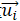，也就是对于所有其他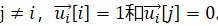。输出层
利用一个标准多项式逻辑函数将最后的隐状态转换为一个概率分布函数来表示每一个ki∈ K的概率分布Pr[mt = ki|w]。

图3中的隐含层仅仅展示了2个隐层，但是实际使用了更多的层。

### 3.2 参数值和性能异常

 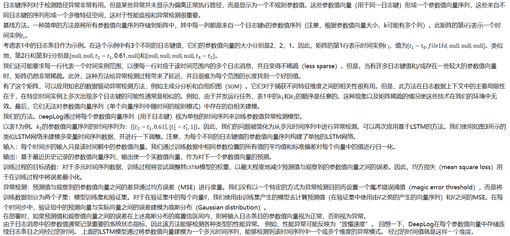 

### 3.3 异常检测模型的在线更新

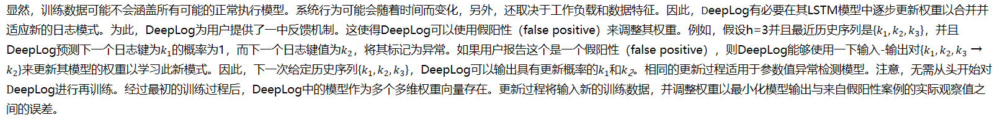

## 4. 多任务执行的工作流构建

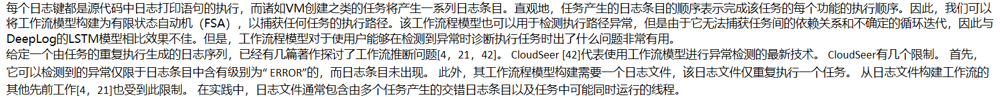

### 4.1 多任务中的日志条目分离

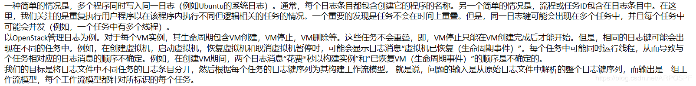

### 4.2 基于DeepLog的异常检测模型

#### 4.2.1 日志键分离

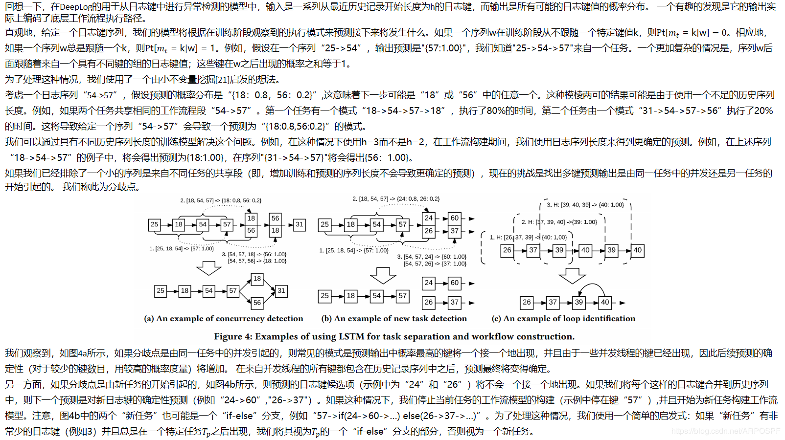

#### 4.2.2 构建工作流模型

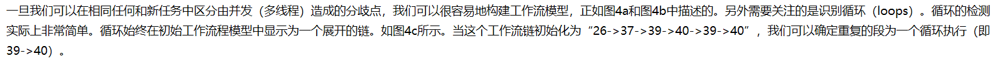

### 4.3 使用基于密度的聚类方法

#### 4.3.1 日志键分离

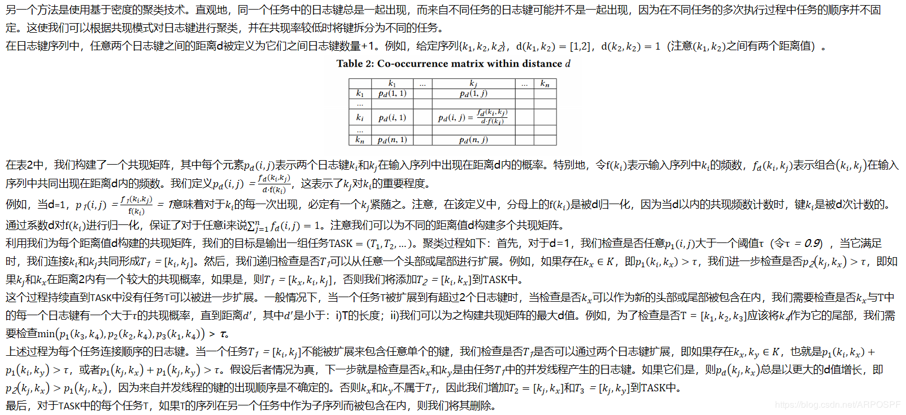

#### 4.3.2 构建工作流模型

一旦分离出每个任务的日志键序列并对其进行标识，任务的工作流模型构建就可以遵循第4.2.2节中的内容。 

### 4.4 使用工作流模型

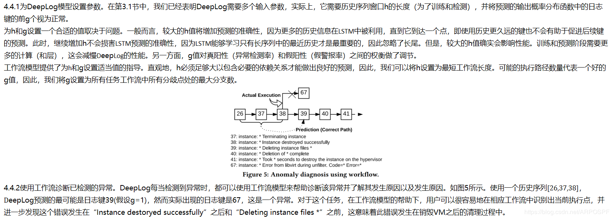

### 4.5 讨论

先前的工作[4，21，42]专注于仅通过一项任务的多次执行来构造工作流。 他们的方法的基本思想分三个步骤：1）挖掘每对日志键的时间依赖性； 2）根据步骤1中确定的成对不变量构建基本工作流程； 3）使用输入的日志键序列优化工作流程模型。 一个主要的限制是它们不能使用包含多个任务或一个任务中有多个并发线程的日志序列，这是我们的研究解决的。 我们的任务分离方法还为每个任务的工作流构建提供了有用的见解。 

## 5. 评估

DeepLog是使用Keras [6]和TensorFlow [2]作为后端实现的。 在本节中，我们将对DeepLog的每个组件和整体性能进行评估，以展示其在从大型系统日志数据中查找异常的有效性。 

### 5.1 执行路径异常检测

本节重点介绍了评估DeepLog中日志键异常检测模型。我们首先将其在大型系统日志上的有效性和以前的方法进行比较，然后研究DeepLog中不同参数的影响。 

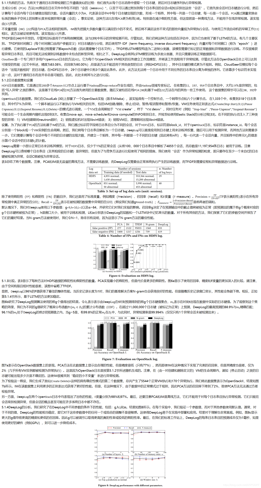

### 5.2 参数值和性能异常

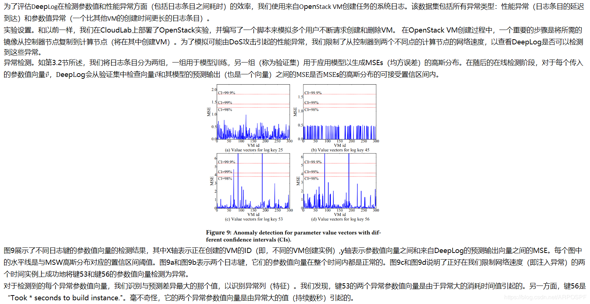

### 5.3 DeepLog的在线更新和训练

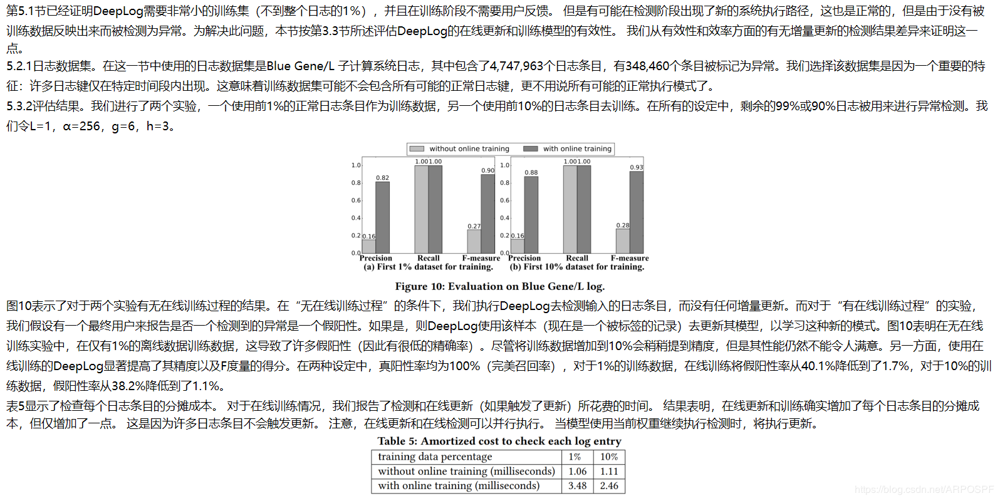

### 5.4 安全日志案例研究

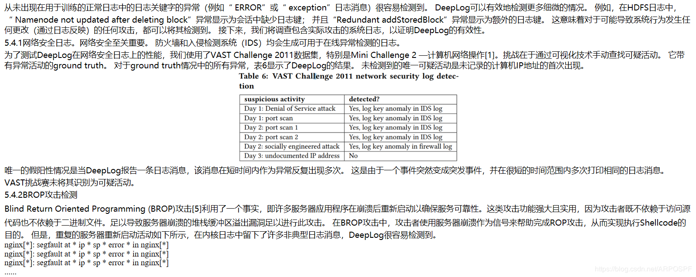

### 5.5 任务分离与工作流构建

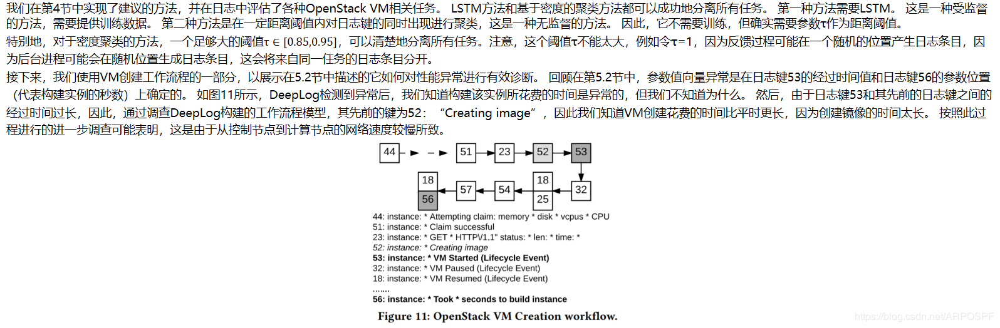

## 6. 相关工作

系统事件日志主要用于记录重要事件以简化调试，它具有丰富的信息，并且实际上存在于每个计算机系统上，从而使它们成为跟踪和调查系统状态的宝贵资源。但是，由于系统日志主要由各种自由格式的文本组成，因此分析具有挑战性。

已经针对不同的系统设计了许多日志挖掘工具。 许多使用基于规则的方法[7、15、28、29、31、32、40、41]，尽管准确，但仅限于特定的应用场景，并且还需要领域专业知识。 例如，Beehive [41]通过对数据特定特征进行无监督的聚类，然后手动标记异常值，从日志中识别出潜在的安全威胁。 Oprea [28]使用信念传播从DNS日志中检测早期企业感染。 PerfAugur [32]专门用于通过使用谓词组合等专门功能来挖掘服务日志来发现性能问题。 DeepLog是一种通用方法，不依赖于任何特定于域的知识。

使用系统日志进行异常检测的其他通用方法通常采用两步过程。首先，日志解析器[9、14、16、23、36、37]用于将日志条目解析为结构化形式，通常仅包含“日志键”（或“消息类型”）。除了用于分隔和分组日志条目的标识符外，参数值和时间戳都将被丢弃。然后，对日志键序列执行异常检测。一种典型的方法是通过计数唯一的日志键或使用更复杂的方法（例如TF-IDF）为每个会话或时间窗口生成数字矢量。然后，由这些向量组成的矩阵将适合基于矩阵的无监督异常检测方法，例如主成分分析（PCA）[38，39]和不变挖掘（IM）[22]。构造这样的矩阵通常是一个精妙的过程，并且这些方法不能提供日志条目级别的异常检测（相反，它们只能在会话级别运行）。我们向读者推荐[17]，以对这些方法进行概述和比较。

有监督方法[17，44]使用正常和异常矢量来训练可检测未来异常的二进制分类器。这种方法的缺点是，可能无法检测到训练数据中未发现的未知异常。此外，很难获得异常数据进行训练。我们在评估中显示，仅使用一小部分正常数据进行训练，DeepLog可以实现具有更好性能的在线异常检测。此外，DeepLog还使用时间戳和参数值进行异常检测，这是先前工作中所缺少的。

人们已经大量使用从精细日志文件中提取的日志键来研究工作流的构建[4，11，21，42]。已经表明，工作流在异常检测方面提供了有限的优势[11，42]。相反，工作流的主要用途是辅助系统诊断[4，21]。但是，所有过去的工作都假定要建模的日志文件仅包含一个任务的重复执行。在本文中，我们提出了自动将不同任务与日志文件分离的方法，以便为不同任务构建工作流模型。

除了工作流之外，其他使用系统日志执行异常诊断的系统包括DISTALYZER [26]，它通过将有问题的日志与正常日志进行比较来诊断系统性能问题； LogCluster [19]，它聚类并组织历史日志以帮助将来的问题识别；以及Stitch [45]从系统日志中提取不同级别的标识符，并构建一个Web界面供用户直观地监视每个进程的进度会话并查找性能问题。请注意，一旦检测到异常，它们便用于诊断目的，并且本身不能用于异常检测。

## 7. 结论

本文介绍了DeepLog，这是一种使用基于深度神经网络的方法进行在线日志异常检测和诊断的通用框架。 DeepLog学习并编码整个日志消息，包括时间戳，日志密钥和参数值。它在每个日志条目级别而不是在每个会话级别执行异常检测，因为许多以前的方法都受到限制。DeepLog可以从日志文件中分离出不同的任务，并使用深度学习（LSTM）和经典挖掘（密度聚类）方法为每个任务构建工作流模型。这样可以进行有效的异常诊断。通过整合用户反馈，DeepLog支持对其LSTM模型的在线更新/训练，因此能够整合并适应新的执行模式。对大型系统日志的广泛评估清楚地证明了DeepLog与以前的方法相比的优越性。

未来的工作包括但不限于将其他类型的RNN（递归神经网络）合并到DeepLog中以测试其效率，并集成来自不同应用程序和系统的日志数据以执行更全面的系统诊断（例如，MySQL数据库的故障可能是由磁盘故障引起，正如一个独立的系统日志中所示）。