- 转载自： https://github.com/AmateurEvents/article/issues/2 

# 基于系统日志分析的异常检测

**摘要**：异常检测在现代大规模分布式系统的管理中起着重要作用。记录系统运行时信息的日志广泛用于异常检测。传统上，开发人员(或操作者)经常用关键字搜索和规则匹配手动检查日志。然而，现代系统的规模和复杂性不断增加，使得日志爆增，这使得人工检测变得不可行。为了减少人工工作量，提出了许多基于自动日志分析的异常检测方法。然而，开发人员可能仍然不知道他们应该采用哪种异常检测方法，因为这些异常检测方法之间缺乏review和比较。此外，即使开发人员决定采用异常检测方法，重新实现也需要付出不小的努力。为了解决这些问题，我们详细回顾和评估了六种最先进的基于日志的异常检测方法，包括三种监督方法和三种非监督方法，并发布了一个开源工具包，便于重用。在两个公开可用的生产日志数据集上对这些方法进行了评估，共有15923592条日志消息和365298个异常实例。我们相信，我们的工作，连同评估结果以及相应的调查结果，可以为采用这些方法提供指导，并为未来的发展提供参考。

## 一 说明

现代系统正在向大规模发展，通过构建的数千台机器来扩展分布式系统（例如hadoop，spark），通过使用数千台处理器的超级计算机来扩展高性能计算（例如Blue Gene/L ）。这些系统正在成为IT行业的核心部分，支持多种在线服务(如搜索引擎、社交网络和电子商务)和智能应用(如天气预报、商业智能和生物医学工程)。因为这些系统大多设计为全天候运行，为全球数百万在线用户提供服务，所以高可用性和可靠性成为必须。这些系统的任何事件，包括服务中断和服务质量下降，都会导致应用程序崩溃，并导致巨大的收入损失。异常检测旨在及时发现异常系统行为，在大规模系统的事件管理中发挥着重要作用。及时的异常检测允许系统开发人员(或操作员)及时发现问题并立即解决，从而减少系统停机时间。系统通常会生成日志，记录系统运行期间的详细运行时信息。这种广泛可用的日志被用作系统异常检测的主要数据源。基于日志的异常检测已经成为学术界和工业界具有实际重要性的研究课题。对于传统的独立系统，开发人员根据他们的领域知识手动检查系统日志或编写规则来检测异常，并额外使用关键字搜索(例如，“失败”、“异常”)或正则表达式匹配。然而，这种严重依赖人工检查日志的异常检测对于大规模系统来说已经变得不充分，基于以下几点：

1. 现代系统的大规模和并行性使得系统行为过于复杂，每个开发人员都无法理解，他们通常只负责子组件。例如，许多开源系统(例如Hadoop、Spark )由数百名开发人员实现。开发人员可能对整个系统行为只有不完全的了解，因此从大量日志中识别问题是一项巨大的挑战。
2. 现代系统正在以每小时约50Gb(约1.2亿~ 2亿行)的速度生成大量日志，这种日志的庞大数量使得从噪声数据中手动识别关键信息以进行异常检测变得非常困难，即使是使用搜索和grep这样的实用工具也是如此。
3. 大规模系统通常采用不同的容错机制来构建。系统有时会以冗余方式运行相同的任务，甚至主动终止推测性任务以提高性能。在这种情况下，使用关键字搜索的传统方法对于提取这些系统中的可疑日志消息变得无效，这可能导致许多误报，这些误报实际上是与实际故障无关的日志消息。这将大大增加人工检查的工作量。

因此，针对异常检测的自动日志分析方法非常受欢迎。基于日志的异常检测在过去几十年里得到了广泛的研究。然而，我们发现学术界的研究和工业实践之间存在差距。一方面，开发人员在许多情况下不了解最新的异常检测方法，因为目前缺乏对这一主题的全面审查。他们必须阅读大量文献才能全面了解当前的异常检测方法。这是一项繁琐的任务，但并不能保证找到最合适的方法，因为每项研究工作通常都只是针对特定系统的一个详细报告。如果开发人员事先没有理解这些方法所需的机器学习背景知识，这一困难可能会加剧。另一方面，据我们所知，目前没有基于日志的开源工具可用于异常检测。现有异常检测方法之间也缺乏比较。对于开发人员来说，很难知道哪种方法是解决手头实际问题的最佳方法。为了比较所有候选方法，他们需要用自己的实现来尝试每一种方法。通常需要付出巨大的努力来重现这些方法，因为没有谁能保证正确实现底层的机器学习算法。

为了弥补这一差距，本文对基于日志的异常检测进行了详细的回顾和评估，并发布了一个开源异常检测工具包。我们的目标不是改进任何特定的方法，而是描绘当前异常检测日志分析研究的总体情况。我们相信，我们的工作可以在两个方面为研究人员和实践人员带来好处:回顾可以帮助他们快速理解当前的异常检测方法；而开源工具包允许他们容易地重用现有的方法，并进行进一步的定制或改进。这有助于避免耗时但重复的重新实施工作.

异常检测的日志分析过程包括四个主要步骤:日志收集、日志解析、特征提取和异常检测。在我们的最后一项工作中，我们介绍了自动日志解析方法的回顾和评估，其中公开发布了四个开源日志解析器。在这项工作中，我们将主要关注异常检测的特征提取和机器学习模型。根据所涉及的数据类型和采用的机器学习技术，异常检测方法可以分为两大类:监督异常检测和非监督异常检测。受监督的方法需要有标签的训练数据，对正常情况和异常情况有明确的说明。然后利用分类技术来学习模型，以最大限度地区分正常和异常实例。然而，无监督的方法根本不需要标签。他们的工作基于这样的观察，即异常实例通常表现为远离其他实例的异常点。因此，可以应用无监督学习技术，如聚类。

更具体地说，我们回顾并实施了最近文献中报道的六种代表性异常检测方法，包括三种有监督的方法(即逻辑回归、决策树和SVM )和三种无监督的方法(即日志聚类、PCA和不变量挖掘)。我们还在两个公开可用的日志数据集上对这些方法进行了系统评估，共有15923592条日志消息和365298个异常实例。评估结果以精确度(报告的异常正确率)、召回率(检测到的真实异常率)和效率(不同日志大小的运行时间)报告。虽然数据有限，但我们认为这些结果以及揭示的相应发现可以为采用这些方法提供指导，并作为未来发展的基础。

总之，本文做出了以下贡献：

1. 基于自动日志分析的常用异常检测方法的详细回顾
2. 一个开源工具包，由六种典型的异常检测方法组成
3. 当前异常检测方法有效性和效率的系统评估

本文的其余部分组织如下。第二节描述了基于日志的异常检测的总体框架。第三节回顾了六种典型的异常检测方法。我们在第四节报告了评估结果，并在第五节进行了一些讨论。第六节介绍了相关工作，最后第七节总结了论文

## 二 框架预览

图1说明了基于日志的异常检测的总体框架。异常检测框架主要包括四个步骤:日志收集、日志解析、特征提取和异常检测。

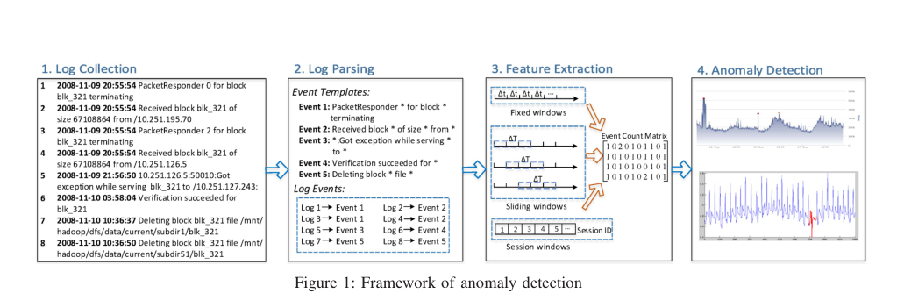

**日志收集**：大规模系统通常会生成日志来记录系统状态和运行时信息，每个日志都包括时间戳和指示发生了什么的日志消息。这些有价值的信息可以用于多种目的(例如，异常检测)，首先收集日志以供进一步使用。例如，图1描绘了从亚马逊EC2平台[ 47 ]上的HDFS日志中提取的8条日志线，而为了便于展示，这里省略了一些字段

**日志解析**：日志是非结构化的，包含自由形式的文本。日志解析的目的是提取一组事件模板，从而可以构造原始日志。更具体地说，每个日志消息都可以被解析成带有一些特定参数(可变部分)的事件模板(恒定部分)。如图1所示，第四条日志消息(日志4 )被解析为"Event2"，事件模板=》"Received block * of size * from *"

**特征提取**：将日志解析成单独的事件后，我们需要进一步将它们编码成数字特征向量，从而可以应用机器学习模型。为此，我们首先使用不同的分组技术将原始日志分割成一组日志序列，包括固定窗口、滑动窗口和会话窗口。然后，对于每个日志序列，我们生成一个特征向量(事件计数向量)，表示每个事件的发生次数。所有特征向量一起可以形成特征矩阵，即事件计数矩阵

**异常检测**：最后，可以将特征矩阵馈送给机器学习模型进行训练，从而生成异常检测模型。所构建的模型可用于识别新进入的日志序列是否异常。

## 三 实践

在这一部分中，我们详细回顾了不同阶段的方法:日志解析、特征提取和异常检测。对于日志解析，我们简要给出了基本思想，并介绍了几种典型的日志解析器。然后，讨论了三种特征提取技术，它们被应用于解析的日志事件以生成特征向量。在获得特征向量后，我们重点研究了六种有代表性的异常检测方法，其中三种是有监督的方法，另外三种是无监督的方法。

### A.日志解析

日志是由固定部分和可变部分组成的纯文本，这些部分在不同的事件中可能会有所不同。例如，对于给出的日志 "Connection from 10.10.34.12 closed" and "Connection from 10.10.34.13 closed",单词 Connection from closed被认为是不变的部分，因为他们总是保持相同，而其余的部分被认为是可变部分，因为它们总是在变。开发人员在源代码中预先定义了常量部分，并且变量部分通常是动态生成的(例如端口号、IP地址)，这在异常检测中无法很好地利用。日志解析的目的是将常量部分与变量部分分开，并形成一个成熟的日志事件（即示例中的"Connection from * closed"）

有两种类型的日志解析方法:基于聚类的方法(例如，LKE[20]，LogSig[44])和基于启发式的方法(例如，iPLoM[29]，SLCT[45])。在基于聚类的日志分析器中，首先计算日志之间的距离，在下一步中，通常使用聚类技术将日志分组到不同的聚类中。最后，从每个集群生成事件模板。对于基于启发式的方法，计算每个日志位置上每个单词的出现次数。接下来，频繁的单词被选择并合成为事件候选词。最后，选择一些候选项作为日志事件。在我们以前的作品[24]中，我们实现并比较了四个日志分析器。此外，我们在线上发布了一个开源日志解析工具包，用于将原始日志解析成日志事件。

### B. 特征提取

该步骤的主要目的是从日志事件中提取有价值的特征，这些特征可以被输入异常检测模型。特征提取的输入是日志解析步骤中生成的日志事件，输出是事件计数矩阵。为了提取特征，我们首先需要将日志数据分成不同的组，其中每个组代表一个日志序列。为此，窗口被应用于将日志数据集划分成有限块。如图1所示，我们使用三种不同类型的窗口:固定窗口、滑动窗口和会话窗口

**固定窗口**：固定窗口和滑动窗口都基于时间戳，时间戳记录每个日志的发生时间。每个固定窗口都有其大小，这意味着时间跨度或持续时间。如图1所示，窗口大小为∆t，这是一个常量值，例如一小时或一天。因此，固定窗口的数量取决于预定义的窗口大小。同一窗口中发生的日志被视为日志序列

**滑动窗口**：与固定窗口不同，滑动窗口由两个属性组成:窗口大小和步长，例如，每小时窗口每五分钟滑动一次。通常，步长小于窗口大小，因此会导致不同窗口的重叠。图1显示了窗口大小是∆T，而步长是转发距离。滑动窗口的数量通常大于固定窗口，主要取决于窗口大小和步长。发生在同一滑动窗口中的日志也被分组为日志序列，尽管由于重叠，日志可能会在多个滑动窗口中重复

**会话窗口**：与上述两种窗口类型相比，会话窗口基于标识符而不是时间戳。标识符用于在一些日志数据中标记不同的执行路径。例如，带有block_id的HDFS日志记录了某些数据块的分配、写入、复制和删除。因此，我们可以根据标识符对日志进行分组，其中每个会话窗口都有一个唯一的标识符。

在利用窗口技术构建日志序列之后，生成事件计数矩阵X。在每个日志序列中，我们计算每个日志事件的发生次数，以形成事件计数向量。例如，如果事件计数向量是[ 0、0、2、3、0、1、0 ]，这意味着在这个日志序列中，事件3发生了两次，事件4发生了三次。最后，大量事件计数向量被构造成事件计数矩阵X，其中条目Xi, j记录了事件j在第i个日志序列中发生了多少次。

### C.监督类异常检测

监督学习(例如决策树)被定义为从标记的训练数据中导出模型的机器学习任务。标记训练数据是监督异常检测的前提，它通过标记来指示正常或异常状态。训练数据的标签越多，模型就越精确。下面我们将介绍三种有代表性的监督方法:逻辑回归、决策树和支持向量机( SVM )。

##### 1.逻辑回归

Logistic回归是一种被广泛用于分类的统计模型。为了决定实例的状态，逻辑回归估计所有可能状态(正常或异常)的概率p。概率p由逻辑函数计算，逻辑函数建立在标记的训练数据上。当出现新实例时，逻辑函数可以计算所有可能状态的概率p (0<p<1 )。获得概率后，概率最大的状态即为分类输出

为了检测异常，从每个日志序列中构造一个事件计数向量，每个事件计数向量及其标签称为实例。首先，我们使用训练实例来建立逻辑回归模型，这实际上是一个逻辑函数。在获得模型后，我们将一个测试实例X输入到逻辑函数中，以计算其异常可能性p，当p≥0.5时，X的标记是异常的，否则是正常的

##### 2.决策树

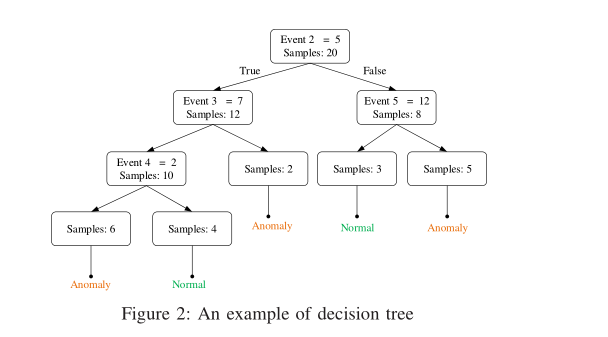

决策树是一个树形结构图，它使用分支来说明每个实例的预测状态。决策树是使用训练数据以自顶向下的方式构建的。每个树节点都是使用当前的“最佳”属性创建的，这是通过属性的信息增益来选择的。例如，图2中的根节点显示，我们的数据集中总共有20个实例。分割根节点时，事件2的出现次数被视为“最佳”属性。因此，根据该属性的值，整个20个训练实例被分成两个子集，其中一个包含12个实例，另一个包含8个实例

决策树首次应用于Web请求日志系统的故障诊断。事件计数向量及其在第III-B节中描述的标签被用来构建决策树。为了检测新实例的状态，它根据每个遍历树节点的谓词遍历决策树。在遍历结束时，实例将到达其中一个叶子，这反映了该实例的状态

##### 3.SVM

支持向量机是一种有监督的分类学习方法。在SVM中，超平面被构造成在高维空间中分离不同类别的实例。找到超平面是一个优化问题，它使超平面和不同类别中最近的数据点之间的距离最大化。

在参考[26]中，使用SVM检测故障并将其与其他方法进行比较。类似于逻辑回归和决策树，训练实例是事件计数向量及其标签。在通过SVM的异常检测中，如果一个新实例位于超平面上方，它将被报告为异常，否则被标记为正常。支持向量机有两种，即线性支持向量机和非线性支持向量机。在本文中，我们只讨论线性支持向量机，因为在我们的大多数实验中，线性支持向量机的性能优于非线性支持向量机。

### D.非监督类异常检测

与有监督的方法不同，无监督学习是另一种常见的机器学习任务，但是它的训练数据没有标记。由于缺乏标签，无监督方法更适用于现实生产环境。常见的非监督方法包括各种聚类方法、关联规则挖掘、PCA等。

##### 1.聚类

在参考[27]中，设计一种基于聚类的方法，称为LogCollect，用于识别在线系统问题。LogCluster需要两个培训阶段，即知识库初始化阶段和在线学习阶段。因此，训练实例分别被分为这两个阶段的两个部分。

知识库初始化阶段包括三个步骤:日志矢量化、日志聚类、代表性向量提取。首先，日志序列被矢量化为事件计数向量，并通过逆文档频率( IDF ) [ 41 ]和归一化进一步修正。其次，LogCluster将正常和异常事件计数向量分别聚类，并以聚集层次聚类的方式生成两组向量聚类(即正常聚类和异常聚类)作为知识库。最后，我们通过计算每个聚类的质心来选择一个代表向量。

在线学习阶段用于进一步调整知识库初始化阶段构建的集群。在线学习阶段，事件计数向量被一个接一个地添加到知识库中。给定一个事件计数向量，计算它和现有代表向量之间的距离。如果最小距离小于阈值，此事件计数向量将被添加到最近的群集，并且此群集的代表向量将被更新。否则，LogCluster将使用此事件计数向量创建一个新群集。

构建知识库并完成在线学习过程后，可以使用LogCollect来检测异常。具体来说，为了确定新日志序列的状态，我们计算它到知识库中代表性向量的距离。如果最小距离大于阈值，则日志序列被报告为异常。否则，如果最近的群集是正常/异常群集，日志序列将被报告为正常/异常

##### 2.PCA

PCA是一种统计方法，被广泛用于进行降维。PCA背后的基本思想是将高维数据(例如，高维点)投影到由k个主分量(即，k个维度)组成的新坐标系中，其中k被设置为小于原始维度。PCA通过寻找捕捉高维数据中最大方差的分量(即轴)来计算k个主分量。因此，PCA变换的低维数据可以保留原始高维数据的主要特征(例如，两点之间的相似性)。例如，在图3中，PCA试图将二维点转换为一维点。Sn被选为主要成分，因为点之间的距离可以通过将它们映射到Sn来最好地描述。

PCA首次应用于基于日志的异常检测，参考[47]。在它们的异常检测方法中，每个日志序列被矢量化为事件计数向量。之后，PCA被用来寻找事件计数向量维度之间的模式。利用PCA，生成两个子空间，即正常空间Sn和异常空间Sa。Sn由前k个主成分构成，Sn由剩余的( n - k )构成，其中n是原始尺寸。然后，计算事件计数向量y到Sa的投影:

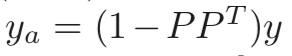

其中P = [ v1，v2，.。。，vk，]是前k个主成分。如果ya的长度大于阈值，相应的事件计数向量将被报告为异常。例如，图3中选择的点是异常的，因为它在Sa上的投影长度太大。具体而言，一个事件计数向量被看作一个异常，如果下面的条件满足： 

其中平方预测误差(即SPE )表示“长度”，而Qα是提供( 1α)置信水平的阈值。我们将Q=0.001设置为原始文件中的值。对于k，我们通过调整PCA来自动计算它，以捕获95 %的数据方差，也与原始论文相同。 

#####  3.Invariants Mining

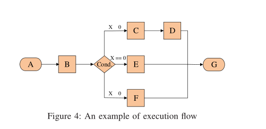

程序不变量是线性关系，即使在不同的输入和不同的工作负载下，在系统运行过程中也始终保持这种关系。不变量挖掘首次应用于基于日志的异常检测在[28]。具有相同会话id (例如，HDFS中的块id )的日志通常表示该会话的程序执行流程。简化的程序执行流程如图4所示。

在这个执行流程中，系统在从A到G的每个阶段都生成一条日志消息。假设系统中运行着大量的实例，并且它们遵循图4中的程序执行流程，下面的等式将是有效的:

n(A) = n(B)
n(B) = n(C) + n(E) + n(F)
n(C) = n(D)
n(G) = n(D) + n(E) + n(F)

其中n(*)表示属于相应事件类型*的日志数量。

直觉上，不变量挖掘可以揭示代表系统正常执行行为的多个日志事件之间的线性关系(例如，n ( A ) = n ( B ) )。线性关系在现实世界的系统事件中占主导地位。例如，通常，文件打开后必须关闭。因此，带有短语“打开文件”的日志和带有短语“关闭文件”的日志将成对出现。如果实例中日志事件“打开文件”和“关闭文件”的数量不相等，它将被标记为异常，因为它违反了线性关系。

不变量挖掘旨在寻找不变量(即线性关系)，包含三个步骤。不变量挖掘的输入是从日志序列生成的事件计数矩阵，其中每行都是事件计数向量。首先，利用奇异值分解估计不变空间，确定下一步需要挖掘的不变量r。其次，该方法通过强力搜索算法找出不变量。最后，通过将其支持度与阈值(例如，98 %的事件计数向量支持)进行比较，验证每个挖掘的不变候选。该步骤将继续，直到获得r个独立不变量。

在基于不变量的异常检测中，当新的日志序列到达时，我们检查它是否遵循不变量。如果至少有一个不变量被破坏，日志序列将被报告为异常。

### E.方法比较

为了加强对上述六种异常检测方法的理解，帮助开发人员更好地选择要使用的异常检测方法，我们在这一部分讨论了不同方法的优缺点。

对于监督方法，异常检测需要标签。决策树比其他两种方法更容易解释，因为开发人员可以通过有意义的解释(即树节点中的谓词)来检测异常。Logistic回归不能解决线性不可分离的问题，这可以通过使用基于核函数的SVM来解决。然而，SVM的参数很难调整(例如，惩罚参数)，因此建立模型通常需要大量人工努力。

由于缺乏标签，无监督的方法更加实用和有意义。日志聚类使用在线学习的思想。因此，它适合处理大量日志数据。不变量挖掘不仅可以高精度地检测异常，而且可以为每个检测到的异常提供有意义和直观的解释。然而，不变量挖掘过程非常耗时。PCA不容易理解，并且对数据敏感。因此，不同数据集的异常检测精度不同。

### F.工具实现

我们在Python中实现了6种异常检测方法，有4000多行代码，并将它们打包成工具包。对于有监督的方法，我们利用广泛使用的机器学习包scikit-learning[39]来实现Logistic回归、决策树和SVM的学习模型。SVM和Logistic回归中有很多参数，我们在训练中手动调整这些参数以获得最佳结果。对于SVM，我们逐一尝试了不同的核函数和相关参数，发现线性核函数支持向量机比其他核函数具有更好的异常检测精度。对于逻辑回归，也探索了不同的参数，并对它们进行了仔细的调整，以获得最佳性能。

然而，实现无监督的方法并不简单。对于日志聚类，我们不能直接使用scikit-learn中的聚类API，因为它不是为大规模数据集设计的，因为我们的数据不适合内存。我们将聚类算法实现为在线版本，其中每个数据实例被一个接一个地分组为一个聚类。有多个阈值需要调整。我们也付出了巨大的努力来实现不变量挖掘方法，因为我们为可能的不变量建立了搜索空间，并提出了多种方法来修正所有不必要的不变量。测试阈值的不同组合非常耗时。我们最终实现了PCA方法，根据原始参考，基于scikit-learning中的API。PCA只有两个参数，很容易调整。

## 四 结果评估

在这一部分，我们将首先介绍我们使用的数据集和我们评估的实验设置。然后，我们分别提供有监督和无监督异常检测方法的评估结果，因为这两种方法通常适用于不同的环境。最后，对所有这些方法的效率进行了评估。

### A.实验设计

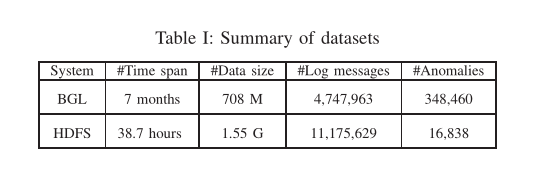

**日志数据集**：公开发布的生产日志是稀缺的数据，因为公司由于机密问题很少发布它们。幸运的是，通过探索大量文献并与相应的作者密切联系，我们成功地获得了两个日志数据集，HDFS数据[47]和BGL数据[36]，它们适合于评估现有的异常检测方法。这两个数据集都是从生产系统收集的，共有15923592条日志消息和365298个异常样本，由原始领域专家手动标记。因此，我们将这些标签(异常与否)作为准确性评估的基础事实。表一提供了数据集的更多统计信息。

HDFS数据包含11175629条日志消息，这些消息是从亚马逊EC2平台[47]收集的。HDFS日志记录每个数据块操作(如分配、写入、复制、删除)的唯一数据块ID。因此，日志中的操作可以更自然地被会话窗口捕获，如III - B中所介绍的，因为每个唯一的块ID可以用来将日志分割成一组日志序列。然后，我们从这些日志序列中提取特征向量，并生成575061个事件计数向量。其中，16838个样本被标记为异常。

BGL数据包含4747963条日志信息，由Lawrence Livermore国家实验室( LLNL ) [36]的BlueGene / L超级计算机系统记录。与HDFS数据不同，BGL日志没有记录每个作业执行的标识符。因此，我们必须使用固定窗口或滑动窗口将日志切片为日志序列，然后提取相应的事件计数向量。但是窗口的数量取决于选择的窗口大小(和步长)。在BGL数据中，348460条日志消息被标记为故障，如果该序列中存在任何故障日志，则日志序列被标记为异常。

**实验设置**：我们在Linux服务器上运行所有实验，该服务器配备英特尔至强E5 - 2670 v2 CPU和128 GB DDR 3 1600 RAM，64位Ubuntu 14.04.2和Linux内核3.16.0正在其上运行。除非另有说明，每个实验运行五次，并报告平均结果。我们使用精度、召回率和F-measure (最常用的度量)来评估异常检测方法的准确性，因为我们已经掌握了这两个数据集的基本真相(异常与否)。如下所示，精度测量报告的异常正确率，召回率测量检测到的真实异常率，F-measure表示精度和召回率的调和平均值。

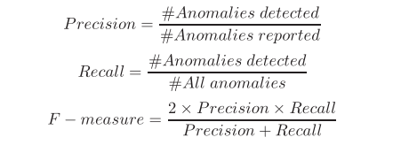

对于所有三种监督方法，我们选择前80 %的数据作为训练数据，剩下的20 %作为测试数据，因为只有先前发生的事件可能导致后续的异常。默认情况下，我们将固定窗口的窗口大小设置为1小时，将滑动窗口的窗口大小和步长分别设置为6小时和1小时。

### B.监督方法的准确性

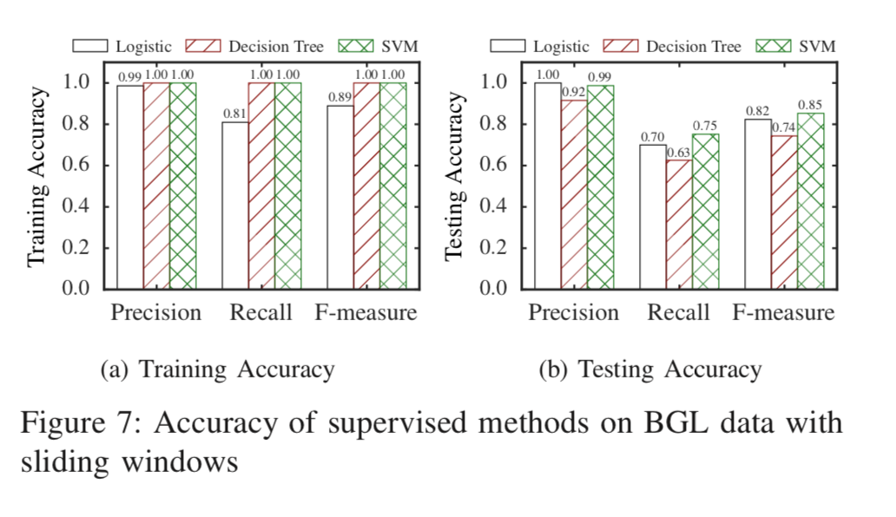

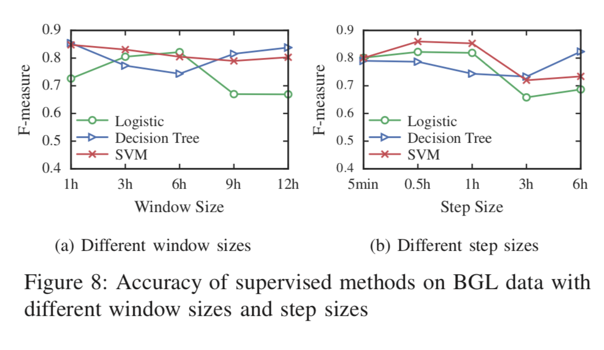

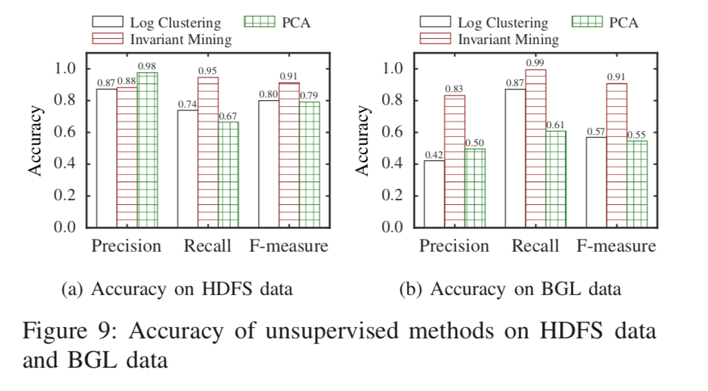

为了探索监督方法的准确性，我们使用它们来检测HDFS数据和BGL数据上的异常。我们使用会话窗口分割HDFS数据，然后生成事件计数矩阵，而固定窗口和滑动窗口分别应用于BGL数据。为了检验三种监督方法(即Logistic回归、决策树、SVM )的有效性，我们首先在训练数据上训练模型，然后将其应用于测试数据。我们报告了不同环境下的训练精度和测试精度，如图7 ~ 9所示。我们可以观察到，所有监督方法都达到了很高的训练精度(超过0.95 )，这意味着通过使用我们的特征表示，正常实例和异常实例可以很好地分离。然而，它们对测试数据的准确性因不同的方法和数据集而异。HDFS数据的总体精度高于固定窗口和滑动窗口BGL数据的精度。这主要是因为HDFS系统只记录了29种事件类型的相对简单的操作，这远远小于BGL数据中的385种。此外，HDFS数据按会话窗口分组，从而在每个日志序列中的事件之间产生更高的相关性。因此，HDFS上的异常检测方法比BGL上的异常检测方法性能更好。 

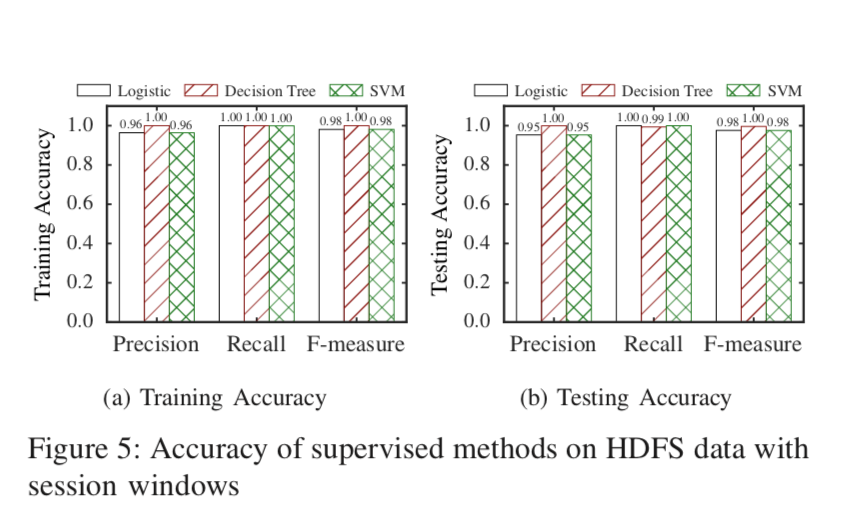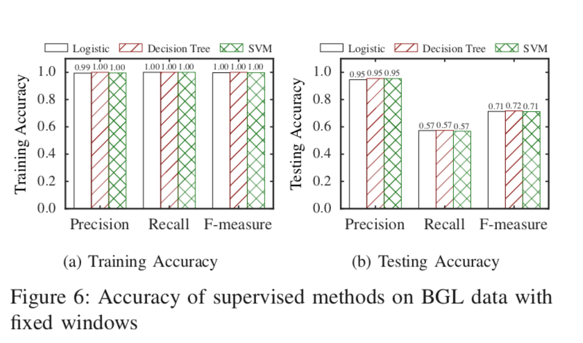

特别是，图5显示了HDFS数据异常检测的准确性，所有三种方法在F-measure接近1的情况下测试数据时都有出色的性能。当在固定窗口的BGL测试数据上应用监督方法时，虽然它们在训练数据上表现良好，但并不能达到高精度。如图6所示，在具有固定窗口的BGL上，所有三种方法的召回率仅为0.57，而它们的高检测精度为0.95。我们发现，由于固定窗口大小只有一个小时，因此，它可能会导致异常的不均匀分布。例如，当前窗口中发生的一些异常可能实际上与前一个时间窗口中的事件有关，并且它们被错误地划分。因此，一小时固定窗口的异常检测方法在BGL数据上表现不佳。 

**发现1 :有监督的异常检测方法实现了高精度，而召回率因不同数据集和窗口设置而异** 

为了解决固定窗口性能差的问题，我们使用滑动窗口来拆分BGL数据，设置窗口大小为6h、步长为1h。结果如图7所示。与固定窗口相比，基于滑动窗口的异常检测对测试数据具有更高的准确性。原因在于，通过使用滑动窗口，我们不仅可以获得与固定窗口一样多的窗口(事件计数向量)，而且可以避免由于窗口大小大得多而导致的分布不均的问题。在有监督的方法中，我们观察到支持向量机F-measure值为0.85时达到了最佳的整体精度。。此外，与固定窗口的结果相比，基于滑动窗口的决策树和逻辑回归在召回率方面分别提高了10.5%和31.6%。 

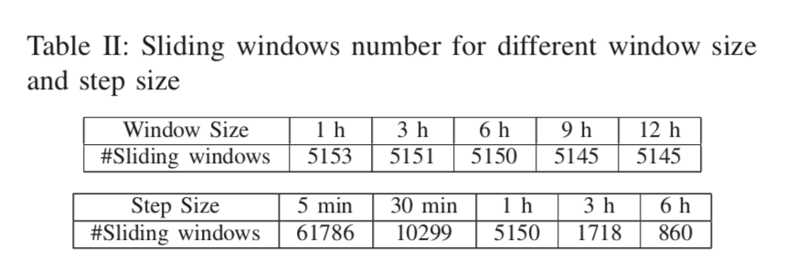

为了进一步研究不同窗口大小和不同步长对异常检测精度的影响，我们通过改变一个参数同时保持另一个参数不变来进行实验。根据图8的图表a )，我们将步长保持在一小时，同时改变窗口大小，如表II所示。大于12小时的窗口大小不被考虑，因为它们在实际应用中不实用。我们可以观察到，随着窗口大小的增加，SVM的F-measure略有下降，而Logistic回归的精度先缓慢增加，但当窗口大小增加到9小时时，精度急剧下降，然后保持稳定。显而易见，当窗口大小为6小时时，逻辑回归获得了最高精度。决策树准确率的变化趋势与logistic回归相反，在12小时达到最高准确率。因此，逻辑回归对窗口大小敏感，而决策树和SVM保持稳定。 

**发现2 :滑动窗口的异常检测可以比固定窗口获得更高的精度。**

与窗口大小相比，步长可能对异常检测精度有很大影响。表二显示，如果我们减小步长，同时将窗口大小保持在6小时，滑动窗口(数据实例)的数量会急剧增加。所有三种方法都显示出相同的趋势，精度首先略有提高，然后在3小时左右下降。这可能是因为当使用大步长时，例如在3小时，数据实例的数量急剧减少。六小时的步长出现了一个例外:窗口大小等于步长，因此滑动窗口与固定窗口相同。在这种情况下，由重叠引起的一些噪声被去除，这导致检测精度的小幅度提高。

### C.无监督方法的准确性

尽管受监督的方法实现了高精度，特别是在HDFS数据上，但是这些方法不一定适用于实际环境，因为在实际环境中数据标签经常不可用。针对这一问题，提出了无监督异常检测方法。为了探索无监督方法的异常检测精度，我们在HDFS数据和BGL数据上对它们进行评估。如上一节所示，滑动窗口可以导致更准确的异常检测。因此，我们只报告BGL数据上滑动窗口的结果。

由于日志群集在具有50万个实例的HDFS数据上非常耗时，因此调整参数变得不切实际，因此我们选择在合理时间内可以处理的最大日志大小来表示HDFS数据。

在图9中，我们可以观察到，所有无监督的方法在HDFS数据上显示出良好的准确性，但是它们在BGL数据上获得的准确性相对较低。在三种方法中，不变量挖掘在这两种数据上取得了优于其他无监督异常检测方法的性能( F-measure为0.91 )。不变量挖掘自动构建线性相关模式来检测异常，这与BGL数据的本质非常吻合，在BGL数据中，故障通过一些关键事件来标记。日志聚类和PCA在BGL数据上没有获得良好的检测精度。日志聚类的性能差是由事件计数矩阵的高维稀疏特性造成的。因此，日志聚类很难区分异常和正常情况，这通常会导致大量误报。

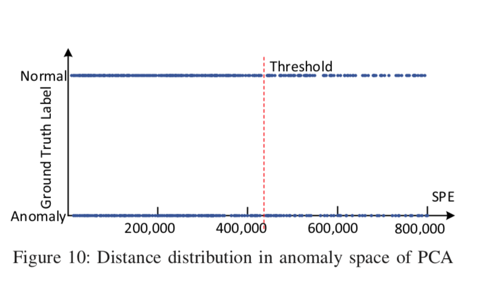

我们进行了深入的研究，以进一步理解为什么PCA不能在BGL数据上实现高精度。PCA检测异常的标准是到正常空间的距离(平方预测误差)。如图10所示，当距离大于特定阈值时(红色虚线表示我们当前的阈值)，一个实例被识别为异常。然而，通过使用地面真实标签来绘制距离分布，如图10所示，我们发现两个类别(正常和异常)不能被任何单一的阈值自然分开。因此，PCA在BGL数据上表现不佳。

**发现3 :与监督方法相比，非监督方法的性能通常较差。但是不变量挖掘是一种性能稳定、高效的方法。**

像监督方法一样，我们也对不同的窗口大小和步长设置进行实验，以探索它们对准确性的影响。如图11所示，我们有一个有趣的观察，即随着窗口大小的增加，精度会稳步提高，而步长的变化对精度影响很小。这一观察与我们发现的监督方法相反。如表II所示，当窗口大小增加时，窗口数量大大减少。给定更大的窗口大小，覆盖更多的信息，同时也可以添加更多的噪声，但是无监督的方法可以发现更准确的异常检测模式

**发现4 :窗口大小和步长的设置对监督方法和非监督方法有不同的影响。**

### D.异常检测方法的效率

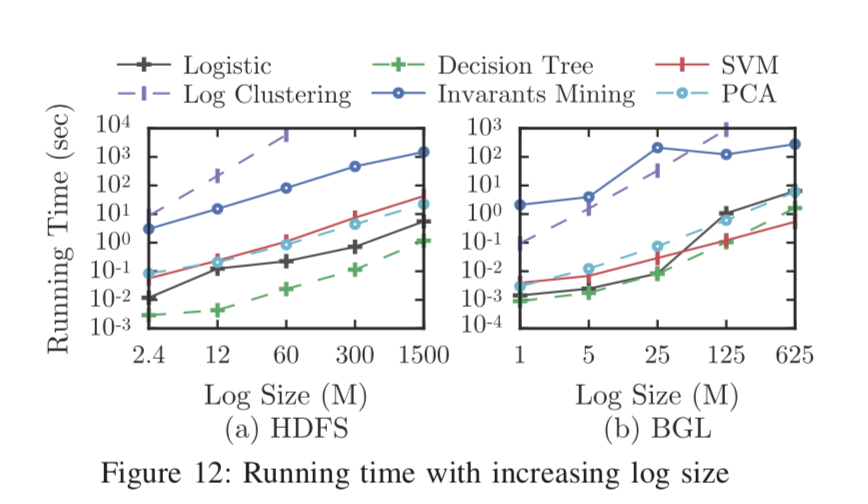

在图12中，所有这些异常检测方法的效率都在两个日志大小不同的数据集上进行评估。如图所示，有监督的方法可以在短时间内(不到一分钟)检测异常，而无监督的方法更耗时( PCA除外)。我们可以观察到，除了时间复杂度为O ( N2 )的日志聚类之外，所有异常检测方法都随着日志大小的增加而线性扩展。请注意，水平轴和垂直轴都不是线性比例。此外，日志聚类无法在可接受的时间内处理大规模数据集；因此，日志聚类的运行时间结果没有完全绘制出来。值得注意的是，不变量挖掘的运行时间大于BGL数据上的日志聚类，而不是HDFS数据上的日志聚类，因为BGL数据中的事件类型多于HDFS数据，这增加了不变量挖掘的时间。此外，还应该注意的是，在BGL数据的日志大小为125兆字节时，不变量挖掘的运行时间略有减少。这是因为我们设置了停止标准来控制其在大型数据集上的强力搜索过程，这可以避免不必要的高维相关性搜索。

**发现5 :大多数异常检测方法随着日志大小线性扩展，但是日志聚类和不变量挖掘方法需要进一步优化以加快速度。**

## 五.讨论

在这一部分中，我们讨论了我们工作的一些局限性，并进一步为未来的研究提供了一些潜在的方向。

**数据集的多样性**：生产系统记录的日志对于评估异常检测方法非常重要。然而，公开可用的日志数据集是稀缺资源，因为公司经常由于机密问题而不愿意打开他们的日志数据。这是评估变得困难的地方。由于[36]，[47]作者的支持，我们获得了两个生产日志数据集，这使得我们的工作得以进行。数据集代表两种不同类型系统的日志，但是评估结果和发现可能仍然受到数据集多样性的限制。显然，更多日志数据集的可用性将允许我们总结我们的发现，并大力支持相关研究。我们未来的计划是从开放平台收集更多日志数据集。

**特征表示**：通常，不同的系统通常有非常不同的日志，如HDFS和BGL数据集所示。为了概括我们不同异常检测方法的实现，我们主要关注由事件计数矩阵表示的特征空间，这已经在大多数现有工作中使用(例如，[28]，[4] )。还有一些其他特征需要进一步探索，例如日志消息的时间戳，由此可以提取两个连续事件的持续时间和日志序列的顺序信息。然而，正如[28]报道的那样，现代分布式系统生成的日志通常由不同的进程交织在一起。因此，从这些日志中提取可靠的时间特征成为一个巨大的挑战。

**其他可利用的方法**：我们已经审查并实施了大多数常用的、有代表性的异常检测日志分析方法。然而，还有一些采用不同模型的其他方法，例如频繁序列挖掘[22]、有限状态机[20]、形式概念分析[18]和信息检索[30]。我们还认为，由于日志分析的实际重要性，将会出现更多的日志。我们正在实施和维护一套更全面的开源工具。

**开源日志分析工具**：目前缺乏可直接用于异常检测的公开日志分析工具。我们还注意到，一系列新公司(如[3]、[4])正在提供日志分析工具作为他们的产品。但是他们都像黑匣子一样工作。这将导致可重复研究的难度增加，并减慢整个创新过程。我们希望我们的工作为公开源代码迈出了第一步，我们提倡在这方面做出更多努力。

**潜在的方向**：

1. 方法的可解释性。目前大多数基于日志的异常检测方法都建立在机器学习模型(如PCA )上。但是这些模型中的大多数都像一个“黑匣子”。也就是说，它们很难解释来提供直观的见解，开发人员经常无法弄清楚异常是什么。非常需要能够反映异常性质的方法
2. 实时日志分析。当前的系统和平台经常实时生成大量日志。因此，实时处理大日志数据成为一大挑战。大数据平台上日志分析工具的开发和实时异常检测的功能是需要的

## 六.相关工作

**日志分析**:日志分析已被广泛用于提高软件系统在许多方面的可靠性，如异常检测[10]、[28]、[47]、故障诊断[17]、[31]、[38]、程序验证[11]、[42]和性能预测[16]。这些日志分析方法大多包括两个步骤:日志解析和日志挖掘，这两个步骤近年来得到了广泛的研究。He等人[24]评估四种离线日志解析方法的有效性，SLCT[45]、IPLOM [29]、LogSig [44]和LKE [20]，它们不需要系统源代码。Nagappan等人[34]提出了一种享受线性运行时间和空间的离线日志解析方法。徐等人[47]设计了一种基于系统源代码的在线日志解析方法。对于日志挖掘，徐等人[47]使用PCA检测异常，PCA的输入是从日志中生成的矩阵。Bessatnikh等人[11]利用系统日志生成有限状态机，描述系统运行时行为。不同于这些使用日志分析来解决不同问题的论文，我们关注基于日志分析的异常检测方法。

**异常检测**:异常检测的目的是发现异常行为，这可以报告给开发人员进行手动检查和调试。Bovenzi等人[13]提出了一种操作系统级别的异常检测方法，对于任务关键型系统是有效的。Venkatakrishnan等人[46]检测安全异常，以防止攻击破坏系统。与这些侧重于检测特定异常的方法不同，本文评估了大规模系统中一般异常检测方法的有效性。巴奔科等人[9]设计了一种利用异常检测到的故障自动生成解释的技术。阿隆索等人[6]通过使用不同的分类器来检测异常。Fashchi等人[19]采用基于回归的分析技术来检测云应用操作的异常。Azevedo等人[8]使用聚类算法来检测卫星中的异常。这些方法利用不同系统收集的性能指标数据，可以补充本文评估的基于日志的异常检测方法。基于日志的异常检测得到了广泛研究，[19]、[20]、[28]、[31]、[43]、[47]。在这篇论文中，我们回顾和评估了六种异常检测方法，这些方法采用了日志分析[12]、[15]、[26]、[27]、[28]、[47]，因为它们新颖且具有代表性。

**经验学习**：近年来，出现了许多关于软件可靠性的实证研究，因为实证研究通常可以为研究人员和开发人员提供有用和实用的见解。袁等人[48]研究开源系统的日志记录实践，并为开发者提供改进建议。傅等人[21]，[49]对工业伐木实践进行了实证研究。Pechia等人[37]研究工业项目中影响测井分析的测井目标和问题。阿莫林等人[7]评估使用决策树算法识别代码气味的有效性。兰萨罗等人[25]分析库代码中的软件故障如何表现为接口错误。萨哈等人[40]从五个不同的角度研究长寿的虫子。米伦科夫斯基等人[33]调查并系统化计算机入侵检测系统评估中的常见做法。钱德拉等人[14]调查在不同类别中使用机器学习技术的异常检测方法，但是本文旨在回顾和对比将日志分析技术应用于系统异常检测的现有工作。

## 七.结论

日志被广泛用于检测现代大规模分布式系统中的异常。然而，由于日志大小的急剧增加，严重依赖人工日志检查的传统异常检测变得不可能。为了减少人工工作量，近年来，自动日志分析和异常检测方法得到了广泛研究。然而，开发人员仍然不知道最先进的异常检测方法，并且经常不得不自己重新设计一种新的异常检测方法，因为目前的方法缺乏全面的回顾和比较。在本文中，我们通过详细回顾和评估六种最先进的异常检测方法来填补这一空白。我们还在两个代表性的生产日志数据集上比较了它们的准确性和效率。此外，我们发布了这些异常检测方法的开源工具包，以便于重用和进一步研究。